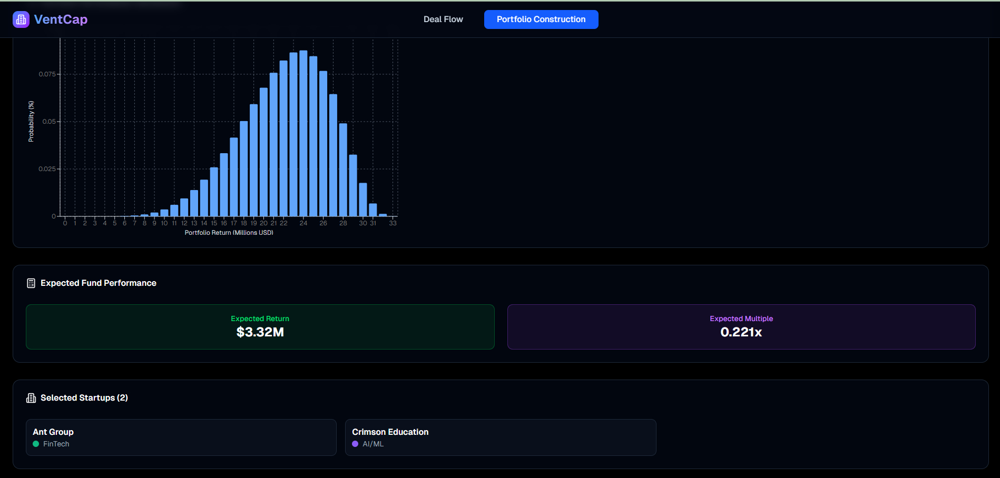

# Venture Capital Portfolio App
> Task Seleksi Lab IRK created by Farhan Nafis Rayhan

versi **28 Juli 2025**

## 💡 Latar Belakang

Venture Capital (VC) adalah bentuk pendanaan yang diberikan oleh investor kepada Startup yang masih dalam tahap awal namun dianggap memiliki potensi pertumbuhan yang besar di masa depan. Sebagai imbalan atas risiko yang mereka ambil, VC biasanya memperoleh kepemilikan sebagian saham dari perusahaan yang didanai. Startup yang menerima dana dari VC akan menjadi bagian dari portfolio VC tersebut, yaitu kumpulan perusahaan yang telah mereka funding. Karena investasi di startup memiliki risiko tinggi—banyak yang gagal meskipun beberapa bisa sangat sukses—VC perlu menyusun portofolionya dengan strategi yang cermat. Salah satu strategi utama yang digunakan adalah sector diversification, yaitu menyebarkan investasi ke berbagai sektor industri seperti teknologi, kesehatan, logistik, pendidikan, dan lainnya. Tujuannya adalah untuk mengurangi risiko kerugian besar jika satu sektor mengalami penurunan. Kalo nonformal dikit ide ini muncul ketika gua memikirkan aplikasi DP dan FFT, sambil nonton Succession. Eh taunya ada episode yang nyinggung Startup dan Venture Capital 🤯.

<div align=center>


<br>
  <b>Fig 1.</b> VentCap Desktop App untuk Waystar Royco
<br>

</div>

> [!WARNING]
> Disclaimer dulu karena persoalan ini pure gua buat-buat sendiri. To be honest i'm not even a finance guy, jadi kemungkinan banyak terminologi dan pemodelan yang tidak sesuai dengan dunia Startup pada aslinya. Gua menyarankan bagi kalian untuk fully ikuti spesifikasi ini aja. Pastikan kalian baca dari awal sampai akhir beberapa kali (Panjang nih boi 😈). If you need any hints or having any questions, feel free to contact my Line.

<br>

## 📝 Spesifikasi Tugas
Pada task ini, kalian harus mengembangkan sebuah Aplikasi <b>berbasis Desktop</b> untuk membantu <b>Venture Capital</b> dalam membangun portfolio pendanaan Startup yang terbaik. Aplikasi harus dibangun menggunakan bahasa <b>Java</b> dengan framework yang dibebaskan, tetapi wajib memiliki basis data <b>MongoDB</b> dan di-containerize dengan <b>Docker</b>. Pembangunan portofolio memiliki tujuan berupa memilih kombinasi Startup yang memiliki probabilitas Capital Gain setinggi mungkin, dibawah batasan budget pendanaan. Algoritma akan membuat keputusan pemilihan Startup dengan pendekatan <b>Dynamic Programming</b>. Setiap langkah algoritma akan membutuhkan perhitungan probabilitas yang cukup berat, oleh karena itu algoritma akan dioptimasi menggunakan <b>Fast Fourier Transform</b>. Venture Capital seringkali tidak mau berinvestasi pada 1 sektor saja, sehingga aplikasi harus dilengkapi dengan <b>Sector Diversification</b>.
Berikut merupakan detail spesifikasi yang wajib diimplementasikan:

### Spesifikasi Wajib (4000 Poin)
1. Tech Stack:
    - Aplikasi yang dikembangkan harus berbasis <b>Desktop</b> dan dapat dijalankan setidaknya pada sistem operasi Linux dan Windows
    - Aplikasi dibangun dengan bahasa <s>Jawa</s> <b>Java</b> dengan framework yang dibebaskan
    - Aplikasi wajib dibangun dengan <b>Maven atau Gradle</b> sebagai build tools
    - Aplikasi menggunakan basis data NoSQL berupa <b>MongoDB</b> yang akan dijelaskan lebih spesifik dibawah
    - Aplikasi wajib di-containerize menggunakan Docker

> [!IMPORTANT]
> Fund & Gain pada konteks aplikasi ini selalu dalam <b>skala jutaan dollar Amerika ($USD)</b>, sehingga segala hal yang berkaitan dengan uang dapat diasumsikan sebagai sebuah bilangan bulat.
2. Startup
    - Startup teridentifikasikan melalui <b>Nama Startup</b>, selain itu aplikasi juga akan menyimpan informasi detail mengenai Startup.
    - Startup dapat dikategorikan menjadi beberapa <b>Funding Stages</b> yaitu:
    > Seed - Series A - Series B - Series C - Series D+
    - Startup memiliki <b>Ticket Size</b>, yaitu besarnya funding yang ingin diraih oleh Startup saat ini, maka ini merupakan biaya investasi yang akan diberikan Venture Capital
    - Startup akan memiliki <b>Gross Proceeds Scenario</b> yaitu skenario dari besarnya uang yang akan diberikan Startup kepada Venture Capital ketika Investment Exit. Hal ini bersifat probabilistik sehingga kita tidak dapat menentukan secara pasti Proceeds yang akan diperoleh. Akan tetapi, Venture Capital dapat menganalisis skenario Proceeds suatu Startup secara pesimis, optimis, maupun realistis. Sebagai contoh, suatu Startup dengan Ticket Size sebesar $5M dapat memiliki skenario berikut:
    > Pessimistic : 0 (Startup gagal dan tidak menghasilkan satupun juta dollar sehingga VC mendapat Capital Gain -5)

    > Realistic : 6 (Startup cukup sukses menghasilkan \$6M sehingga VC mendapatkan Capital Gain 1)

    > Optimistic : 15 (Startup sangat sukses menghasilkan \$15M sehingga VC mendapatkan Capital Gain 10)

    - Gross Proceeds suatu Startup sangat terpengaruh atas trend performance Startup yang mungkin berubah setiap harinya. Akibatnya, Gross Proceeds dapat berubah setiap hari selama berjalannya waktu. Setiap Startup dilengkapi dengan data <b>Trend Gross Proceeds</b> selama 30-90 hari terakhir dalam bentuk barisan bilangan bulat.
    - Startup termasuk dalam salah satu <b>sektor</b> berikut:
    <table>
        <tr>
            <td valign="top">
            <ul>
                <li>Fintech</li>
                <li>Healthtech</li>
                <li>Edtech</li>
                <li>GreenTech</li>
                <li>FoodTech</li>
            </ul>
            </td>
            <td valign="top">
            <ul>
                <li>PropTech</li>
                <li>Cybersecurity</li>
                <li>Gaming</li>
                <li>SpaceTech</li>
                <li>AI/ML</li>
            </ul>
            </td>
        </tr>
    </table>
3. Proceeds Probability Array
    - Terdapat modul untuk menghasilkan suatu <b>array distribusi probabilitas proceeds</b> dari skenario gross proceeds yang diberikan.
    - Untuk setiap index $X$ pada array, maka probabilitas Startup menghasilkan proceeds sebesar $X$ adalah $array[X]$.
    - Sesuai dengan skenario, distribusi probabilitas memiliki index terkecil pada nilai pessimistic, index terkecil pada nilai optimistic, dan probabilitas terbesar pada index nilai realistic.
    - Modul ini dapat diimplementasikan dengan <b>Distribusi Beta</b> melalui pendekatan <b>PERT</b>.
> [!NOTE]
> Gunakan Discrete Probability Mass Function, bukan Probability Density Function.
4. Fast Fourier Transform
    - Ketika kita mengkombinasikan 2 buah Startup, tentunya Array Distribusi Probabilitas Proceed akan perlu dikombinasikan sesuai dengan kaidah probabilita.
    - Hal ini dapat dikalkulasi secara efisien dengan menggunakan algoritma <b>Fast Fourier Transform</b>.
    - Aplikasikan pada algoritma utama aplikasi sehingga algoritma ini menghasilkan array distribusi probabilitas proceed yang tepat ketika diperlukan.

5. Dynamic Programming
    - Venture Capital akan memiliki 3 parameter untuk algoritma ini, yaitu:
        - <b>Investment Budget</b>, yaitu biaya total yang dialokasikan VC untuk investasi seluruh Startup pada portfolionya.
        - <b>Target Fund Gain</b>, yaitu besarnya gain yang ditargetkan oleh VC ketika seluruh Startup portfolionya sudah exit.
        - <b>List of Startup</b>, yaitu kumpulan startup yang akan dikonsiderasi dengan <b>Gross Proceed Scenario yang terdefinisi</b> 
    - Tujuan dari algoritma Dynamic Programming adalah mengonstruksi portfolio (memilih kombinasi startup) sedemikian sehingga <b>peluang gain yang diperoleh mencapai target adalah semaksimal mungkin</b>.
    - Total Ticket Size yang diinvestasikan pada portfolio <b>tidak boleh melebihi</b> Investment Budget
    - <b>Sector Diversification</b>: VC ingin memastikan bahwa <b>tidak ada 2 Startup pada portfolio yang memiliki sektor yang sama</b>, maka implementasikanlah Dynamic Programming dengan state yang memenuhi batasan ini.
    - Integrasikan dengan perhitungan array distribusi probabilitas proceed dan pemilihan kombinasi paling optimal pada setiap state Dynamic Programming.

> [!CAUTION]
> Algoritma ini sangat mungkin memakan memori yang berat, gua sangat menyarankan kalian untuk langsung coba <b>Bonus Optimasi Memori</b>.
6. MongoDB
    - Basis data setidaknya <b>harus memiliki</b> collection `startups` dengan documents seperti berikut:
        ```
        {
            "name": String,  
            "description": String,  
            "fundingStage": Enumerate[SEED, SERIES A, SERIES B, SERIES C, SERIES D+],  
            "ticketSize": Integer,  
            "location": "String",  
            "foundedYear": Integer,  
            "proceedsScenarioTrend": {  
                "Pessimistic": Integer[],  
                "Realistic": Integer[],  
                "Optimistic": Integer[]  
            }  
        }
        ```
    - Kalian <b>diperbolehkan untuk menambahkan collections</b> lainnya untuk meningkatkan performa aplikasi (Contohnya caching koefisien linear recurrence).
    - Untuk keperluan demo, gua akan membagikan dump untuk collections `startups` yang perlu dimigrasi menggunakan <b>mongorestore</b>.
> [!NOTE]
> Kenapa harus NoSQL, karena semester depan kalian akan dibantai SQL secara brutal anyway.

7. Docker
    - Intinya sih ini buat containerize terutama untuk MongoDB.
    - Gua bingung mau nulis apa lagi untuk bagian ini 💀.
    - Kalo kata ciko sih "Biasa lah nggak perlu dijelasin. Dijelasin juga gak jelas dan nggak penting."
    - "You can't make a Tomlette without breaking some Greggs".
8. Halaman Deal Flow
    - Halaman ini meliputi data seluruh Startup yang memiliki potensi untuk diinvestasikan Venture Capital
    - Setiap Startup sudah terorganisasi can "color coded" terhadap sektor. 
    <div align=center>
    

    <br>
    <b>Fig 2.</b> Contoh UI untuk halaman Deal Flow
    <br>

    </div>
    <div align=center>
    
    

    <br>
    <b>Fig 3.</b> Apabila suatu card di klik, munculkan detail Startup seperti berikut
    <br>

    </div>
9. Halaman Portfolio Construction
    - Halaman ini digunakan untuk menjalankan algoritma Portfolio Construction
    - Terdapat input untuk parameter algoritma Dynamic Programming
    - Aplikasi dapat melakukan algoritma tidak untuk hari ini saja, namun dapat melakukan <b>construction dengan skenario masa lalu</b> menggunakan data Trend Proceeds yang diberikan. Terdapat input untuk tanggal yang menentukan kapan construction dilakukan
    - VC dapat memilih Startup dengan klik card yang tersedia. <b>Tidak semua Startup pada Deal Flow selalu dikonsiderasikan saat pembangunan Portfolio</b>.
    - Terdapat button untuk menginisiasi algoritma, lalu keluarkan seluruh hasil Construction yang meliputi:
        - Probabilitas total mencapai target
        - Tangggal yang digunakan saat Pembuatan Construction
        - Distribusi Peluang Gain pada Portfolio
        - Ekspektasi Gain
        - Multiplier yang berupa $Ekspektasi \: Gain / Total \: Investment$
        - Startup yang harus Diinvestasikan
        <div align=center>
        

        <br>
        <b>Fig 4.</b> Contoh Parameter untuk Portfolio Construction
        <br>

        

        <br>
        <b>Fig 5.</b> VC dapat memilih Startup mana saja yang dikonsiderasikan
        <br>

        </div>
        <div align=center>
        
        

        <br>
        <b>Fig 6.</b> Tampilkan hasil Portfolio COnstruction
        <br>

        </div>
10. README
    Berikut adalah hal-hal yang perlu disampaikan pada README:
    - Deskripsi Aplikasi
    - Techstack serta Library yang digunakan
    - Struktur Program
    - Cara Instalasi dan menjalankan program
    - Analisis yang meliputi:
        - Penjelasan singkat mengenai cara kerja algoritma
        - Penggunaan algoritma pada aplikasi
        - Kompleksitas ruang dan waktu algoritma yang diimplementasikan
        Poin ini berlaku untuk masing-masing algoritma berikut:
        - Beta-PERT
        - Fast Fourier Transform
        - Dynamic Programming
        - Linear Recurrence Prediction (Apabila mengerjakan)
    - Greedy Analysis (Apabila mengerjakan)
    - Bebas, silahkan tambahin apapun sekreatif kalian (ya kalo mau 🗿)

### Spesifikasi Bonus (1000 Poin)
> [!WARNING]
> Do Not Attempt this Bonus unless you are dedicated to join IRK Laboratory
1. <b>Linear Recurrence Prediction (700 Poin)</b> 
    Seperti yang dijelaskan sebelumnya, setiap Startup memiliki Gross Proceed Scenario selama 30-90 hari terakhir. Data ini berbentuk suatu barisan bilangan yang (secara kasar) memenuhi Linear Recurrence dengan orde tidak lebih dari 10. Atau secara formal:
    $$x_n = c_1 x_{n-1} + c_2 x_{n-2} + \cdots + c_K x_{n-K}, \:\: k \leq 10$$
    VC tidak hanya melihat keadaan trend startup hari ini saja, namun harus bisa memprediksi sampai jauh di masa depan. Buatlah modul untuk melanjutkan barisan Linear Recurrence sampai nilai $n$ yang sangat besar. Akibatnya, kita akan memiliki Gross Proceed Scenario berhari-hari dari sekarang. Terdapat 2 langkah dalam implementasi modul berikut yaitu:
    - <b>Parameter Estimation:</b> Estimasi koefisien yang paling memenuhi barisan. Tentunya kalian memerlukan cara untuk <b>menentukan orde</b> yang paling sesuai terlebih dahulu
    - <b>Prediction:</b> Inferensikan nilai selanjutnya pada barisan sampai suku ke-$n$. VC yang visioner bisa saja meminta prediksi hingga tahun 4763 (1 juta hari dari sekarang 😱). Oleh karena itu, untuk mencapai nilai $n$ yang sangat tinggi kalian harus melakukan optimasi. Tahap ini harus dapat dilakukan dalam waktu $O(log \: n)$.
    Ajaibnya, kedua tahap ini dapat dilakukan sepenuhnya menggunakan <b>Matrix</b> (Tanpa pendekatan AI/ML sama sekali). Implementasikanlah modul ini, lalu aplikasikan dalam 2 fitur berikut:
        - Saat menampilkan line chart Gross Proceed Scenario Trend, tampilkan pula Trend sampai 90 hari dari sekarang.
        - Kalendar pada Portfolio Construction dapat menerima tanggal setelah hari ini, sehingga algoritma dapat dijalankan untuk kasus jauh di masa depan.
> [!NOTE]
> Apabila kalian menemukan bahwa koefisien mengandung bilangan tidak bulat padahal barisan selalu bulat, silahkan lakukan pembulatan pada hasil perhitungan $a_n$.
> Hasil prediksi seharusnya tidak 100% akurat, apabila setiap suku berhasil mendekati nilai seharusnya pun sudah cukup.
2. <b>DP Memory Optimization (200 Poin)</b>
    Tentunya kalian tahu bahwa kelemahan algoritma DP adalah implementasinya yang selalu makan banyak memori. Oleh karena itu, kalian harus melakukan optimasi memori untuk algoritma ini. Optimasi harus menurunkan kompleksitas ruang algoritma DP secara signifikan. Dengan kata lain kompleksitas ruang harus turun, sebagai contoh dari $O(N^2)$ menjadi $O(N)$. Apabila sudah terpenuhi, optimasi yang tidak menurunkan kompleksitas namun membagi penggunaan ruang dengan suatu faktor konstan $C$ pun juga diperbolehkan.

3. <b>Greedy Analysis (100 Poin)</b>
    Tambahkan pada README beberapa analisis berikut:
    - Strategi Greedy yang menurut anda paling optimal untuk permasalahan ini.
    - Bandingkan dengan algoritma Dynamic Programming yang sudah anda implementasikan, terutama dalam kompleksitas waktu dan ruang.
    - Analisis Optimalitas Algoritma Greedy, apakah sudah pasti mencapai Global Optima?
        - <b>Jika iya:</b> Sertakan bukti optimalitas algoritma secara <i>rigorous</i>.
        - <b>Jika tidak:</b> Berikan Counterexample yang cukup kuat.

## Batasan dan Asumsi
- Aplikasi dibuat untuk <b>satu user</b> VC saja.
- Library yang boleh digunakan <b>bebas</b>, akan tetapi algoritma-algoritma yang disebutkan diatas harus <b>diimplementasikan</b> sendiri.
- Sangat disarankan untuk menggunakan IDE <b>Intellij</b> dan <b>Scene Builder</b>.
- Tanggal yang dimaksud hari ini adalah tanggal perilisan task yaitu <b>4 Agustus 2025</b>.
- ProceedScenarioTrend yang digunakan untuk hari ini adalah <b>data pada akhir barisan</b>.
- Batasan Testcase untuk Aplikasi adalah sebagai berikut: 
    - $\leq 40$ Startups
    - $\leq 1000$ Investment Budget
    - $\leq 10$ Sections involved

## 📂 Pengerjaan dan Pengumpulan
1. Buatlah repositori **private** pada github masing-masing dan invite `Farhannr28` dalam repositori tersebut.
2. Berkas yang dikumpulkan berupa **link rilis tag ke repositori github** yang telah dibuat dengan ketentuan sebagai berikut.
    - Memberikan tag `vn` pada commit terakhir Anda setiap kali ingin melakukan submisi dengan `n` adalah jumlah submisi yang telah dilakukan. (contoh: `v1` untuk submisi pertama).
    - **Tidak menggunakan *url shortener*** (bit.ly, shortlink, atau yang lain) saat melakukan pengumpulan *task*.
    - Anda dapat melakukan rilis dengan panduan [berikut](https://docs.github.com/en/repositories/releasing-projects-on-github/managing-releases-in-a-repository).
3. **Lakukan submisi** pada website seleksi IRK dengan menggunakan akun std.stei.itb.ac.id, **lakukan konfirmasi** ke LINE `@farhannr28`, dan **jadwalkan demo** dengan cara yang sama. Lakukan hal yang sama jika membuat rilis yang baru.
4. Jika terdapat pertanyaan (atau memerlukan hint) dapat menghubungi LINE `@farhannr28`.

## 📌 Penilaian
<table style="border-collapse: collapse; width: 90%; font-family: JetBrains Mono; font-size: 16px;">
  <thead>
    <tr style="background-color: #C1C2AD;">
      <th style="border: 1px solid #abac90; padding: 10px; text-align: center;">Tipe</th>
      <th style="border: 1px solid #abac90; padding: 10px;">Aspek</th>
      <th style="border: 1px solid #abac90; padding: 10px; text-align: center;">Nilai Maksimum</th>
    </tr>
  </thead>
  <tbody>
    <tr style="background-color: #b9dcd528;">
      <td rowspan="5" style="border: 1px solid #abac90; padding: 12px; vertical-align: center; text-align: center; font-weight: bold;">Spesifikasi Wajib</td>
      <td style="border: 1px solid #abac90; padding: 10px;">Algoritma Dynamic Programming</td>
      <td style="border: 1px solid #abac90; padding: 10px; text-align: center;">1500</td>
    </tr>
    <tr style="background-color: #b9dcd528;">
      <td style="border: 1px solid #abac90; padding: 10px;">Algoritma Fast Fourier Transform</td>
      <td style="border: 1px solid #abac90; padding: 10px; text-align: center;">1200</td>
    </tr>
    <tr style="background-color: #b9dcd528;">
      <td style="border: 1px solid #abac90; padding: 10px;">Fitur Wajib Lainnya</td>
      <td style="border: 1px solid #abac90; padding: 10px; text-align: center;">800</td>
    </tr>
    <tr style="background-color: #b9dcd528;">
      <td style="border: 1px solid #abac90; padding: 10px;">Analisis pada Readme</td>
      <td style="border: 1px solid #abac90; padding: 10px; text-align: center;">300</td>
    </tr>
    <tr style="background-color: #b9dcd528;">
      <td style="border: 1px solid #abac90; padding: 10px;">MongoDB & Dockerization</td>
      <td style="border: 1px solid #abac90; padding: 10px; text-align: center;">200</td>
    </tr>
    <tr style="background-color: #B7998928;">
      <td rowspan="6" style="border: 1px solid #abac90; padding: 12px; vertical-align: center; text-align: center; font-weight: bold;">Spesifikasi Bonus</td>
      <td style="border: 1px solid #abac90; padding: 10px;">Linear Recurrence Prediction</td>
      <td style="border: 1px solid #abac90; padding: 10px; text-align: center;">700</td>
    </tr>
    <tr style="background-color: #B7998928;">
      <td style="border: 1px solid #abac90; padding: 10px;">DP Memory Optimization</td>
      <td style="border: 1px solid #abac90; padding: 10px; text-align: center;">200</td>
    </tr>
    <tr style="background-color: #B7998928;">
      <td style="border: 1px solid #abac90; padding: 10px;">Greedy Analysis</td>
      <td style="border: 1px solid #abac90; padding: 10px; text-align: center;">100</td>
    </tr>
    <tr style="background-color: #B7998928;">
      <td style="border: 1px solid #abac90; padding: 10px;">Follow akun <a href="https://letterboxd.com/Farhannr28">Letterboxd</a> gua agar Absolute Cinema</td>
      <td style="border: 1px solid #abac90; padding: 10px; text-align: center;">5</td>
    </tr>
    <tr style="background-color: #B7998928;">
      <td style="border: 1px solid #abac90; padding: 10px;">Follow akun <a href="https://open.spotify.com/user/7k5lgw4rtvuhuykows6105l04">Spotify</a> gua agar semakin skena</td>
      <td style="border: 1px solid #abac90; padding: 10px; text-align: center;">5</td>
    </tr>
    <tr style="background-color: #B7998928;">
        <td style="border: 1px solid #abac90; padding: 10px;">
            <del>Implementasikan aplikasi sebagai Turing Machine</del>
        </td>
        <td style="border: 1px solid #abac90; padding: 10px; text-align: center;">
            <span style="font-size: 32px;"><del>&infin;</del></span>
        </td>
    </tr>
    <tr style="background-color: #D2725228;">
      <td colspan="2" style="border: 1px solid #abac90; padding: 10px; text-align: center; font-weight: bold;">Total Maksimum</td>
      <td style="border: 1px solid #abac90; padding: 10px; text-align: center; font-weight: bold;">5000</td>
    </tr>
  </tbody>
</table>


## 📚 Referensi
> [!IMPORTANT]
> Referensi utamanya gak ada karena gua bikin sendiri problem ini 💀🗿 Jadi here are a few other useful stuff

<table style="border-collapse: collapse; width: 90%; font-family: JetBrains Mono;">
  <thead>
    <tr style="background-color: #C1C2AD; color: white;">
      <th style="padding: 6px; border: 1px solid #abac90;">No</th>
      <th style="padding: 6px; border: 1px solid #abac90;">Link</th>
      <th style="padding: 6px; border: 1px solid #abac90;">Tier</th>
      <th style="padding: 6px; border: 1px solid #abac90;">Catatan</th>
    </tr>
  </thead>
  <tbody>
    <tr>
      <td style="padding: 6px; border: 1px solid #abac90;">1</td>
      <td style="padding: 6px; border: 1px solid #abac90;"><a href="https://docs.oracle.com/en/java/">https://docs.oracle.com/en/java/</a></td>
      <td style="padding: 6px; border: 1px solid #abac90;">Fundamental</td>
      <td style="padding: 6px; border: 1px solid #abac90;">Bahasa Javva</td>
    </tr>
    <tr>
      <td style="padding: 6px; border: 1px solid #abac90;">2</td>
      <td style="padding: 6px; border: 1px solid #abac90;"><a href="https://en.wikipedia.org/wiki/PERT_distribution">https://en.wikipedia.org/wiki/PERT_distribution</a></td>
      <td style="padding: 6px; border: 1px solid #abac90;">Good</td>
      <td style="padding: 6px; border: 1px solid #abac90;">Silahkan cari rumus untuk distribusi PERT-Beta disini</td>
    </tr>
    <tr>
      <td style="padding: 6px; border: 1px solid #abac90;">3</td>
      <td style="padding: 6px; border: 1px solid #abac90;"><a href="https://youtu.be/h7apO7q16V0?feature=shared">https://youtu.be/h7apO7q16V0?feature=shared</a></td>
      <td style="padding: 6px; border: 1px solid #abac90;">Very Recommended</td>
      <td style="padding: 6px; border: 1px solid #abac90;">Explainer untuk FFT</td>
    </tr>
    <tr>
      <td style="padding: 6px; border: 1px solid #abac90;">4</td>
      <td style="padding: 6px; border: 1px solid #abac90;"><a href="https://informatika.stei.itb.ac.id/~rinaldi.munir/Stmik/2024-2025/26-Program-Dinamis-(2025)-Bagian2.pdf">https://informatika.stei.itb.ac.id/~rinaldi.munir/Stmik/2024-2025/26-Program-Dinamis-(2025)-Bagian2.pdf</a></td>
      <td style="padding: 6px; border: 1px solid #abac90;">Recommended</td>
      <td style="padding: 6px; border: 1px solid #abac90;">Review DP lagi bersama GOAT Rinaldi Munir</td>
    </tr>
    <tr>
      <td style="padding: 6px; border: 1px solid #abac90;">5</td>
      <td style="padding: 6px; border: 1px solid #abac90;"><a href="https://informatika.stei.itb.ac.id/~rinaldi.munir/AljabarGeometri/2024-2025/Tubes1-IF2123-2024.pdf">https://informatika.stei.itb.ac.id/~rinaldi.munir/AljabarGeometri/2024-2025/Tubes1-IF2123-2024.pdf</a></td>
      <td style="padding: 6px; border: 1px solid #abac90;">Refresher</td>
      <td style="padding: 6px; border: 1px solid #abac90;">Kalo lupa bahwa kalian pernah implement Matrix di Java</td>
    </tr>
    <tr>
      <td style="padding: 6px; border: 1px solid #abac90;">6</td>
      <td style="padding: 6px; border: 1px solid #abac90;"><a href="https://www.mongodb.com/docs/database-tools/mongorestore/">https://www.mongodb.com/docs/database-tools/mongorestore/</a></td>
      <td style="padding: 6px; border: 1px solid #abac90;">Very Good</td>
      <td style="padding: 6px; border: 1px solid #abac90;">Untuk restore database MongoDB</td>
    </tr>
    <tr>
      <td style="padding: 6px; border: 1px solid #abac90;">7</td>
      <td style="padding: 6px; border: 1px solid #abac90;"><a href="https://www.youtube.com/watch?v=8oeOwmJa8vk">https://www.youtube.com/watch?v=8oeOwmJa8vk</a></td>
      <td style="padding: 6px; border: 1px solid #abac90;">Not a Reference</td>
      <td style="padding: 6px; border: 1px solid #abac90;">Rekomendasi Album (dan Movie) untuk didengarkan selama mengerjakan task</td>
    </tr>
    <tr>
      <td style="padding: 6px; border: 1px solid #abac90;">8</td>
      <td style="padding: 6px; border: 1px solid #abac90;"><a href="https://www.imdb.com/title/tt7660900/">https://www.imdb.com/title/tt7660900/</a></td>
      <td style="padding: 6px; border: 1px solid #abac90;">Not a Reference</td>
      <td style="padding: 6px; border: 1px solid #abac90;">Episode Succession yang menjadi inspirasi untuk domain task ini</td>
    </tr>
    <tr>
      <td style="padding: 6px; border: 1px solid #abac90;">9</td>
      <td style="padding: 6px; border: 1px solid #abac90;"><a href="https://github.com/Farhannr28/Turing-Machine-RSA">https://github.com/Farhannr28/Turing-Machine-RSA</a></td>
      <td style="padding: 6px; border: 1px solid #abac90;">Insane Task</td>
      <td style="padding: 6px; border: 1px solid #abac90;">Contoh implementasi Mesin Turing dengan definisi hampir 1000 line</td>
    </tr>
  </tbody>
</table>


<br>
<br>

**Gampang kok, gak sesusah ide makalah & task gua yang ternyata mathematically proven impossible itu 😅**